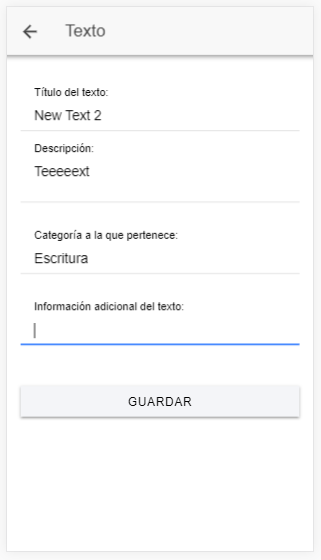

# wda: Write down anything, anywhere, at any time

### WDA es una aplicación que te permite anotar diferentes textos y crear distintas categorías a los cuales asociar (en un futuro) los textos.

## Categorías

#### Como podemos ver nada más iniciar la aplicación, llegamos a la pestaña de categorías, donde podemos crear más o borrar las que no queramos más:

#### Si pulsamos el botón de "Añadir categorías", accederemos a la siguiente ventana, la cual nos permitirá crear nuevas categorías para nuestra aplicación:

## Menú

#### Si pulsamos el icono de "hamburguesa" que podemos ver en la esquina superior izquierda, o deslizamos la pantalla hacia la derecha, accederemos a un menú el cual nos permitirá navegar entre nuestras pestañas de categorías o de textos.

## Textos
#### Si seleccionamos la opción de "Textos" en el menú, accederemos a ésta página, nuestra página de textos:

#### Si pulsamos el botón de "Añadir textos", accederemos a la siguiente ventana, la cual nos permitirá crear nuevos textos para nuestra aplicación:

#### Si decidimos que, en vez de pulsar en el botón de "Añadir textos", decidimos pulsar en algunos de nuestros textos, accederemos a la siguiente ventana, la cual nos permitirá editar nuestros textos o borrarlos definitivamente:

###### La APK se encontrará disponible en un futuro [aquí]().
